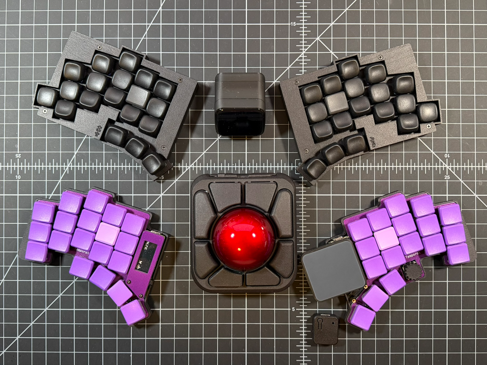

# t4corun ZMK Config

Home of my firmware for the GEIST TOTEM and Curbol Temporal split keyboards

## Hardware

The TOTEM was built first and is a straight forward 38-key split keyboard with splay. The peripheral splits and central dongle all use a Seeed Xiao BLE MCU

The Temporal came later. Mine is the 37-key version of this split keyboard with splay. The right side has an encoder and Azoteq TPS43 multi-touch trackpad. The left side has a Nice!View display. Both peripheral splits use a Nice!Nano v2 MCU and the dongle uses the Seeed Xiao BLE MCU. I built it for travel because it is smaller than the TOTEM, and I find its thumb cluster more comfortable (more splay).

## Firmware

This is a port of my QMK Firmware keymap. It is inspired by Miryoku and designed with SQL and Powershell in mind. It features

- Supports Zephyr 4.1
- Builds dongle firmware for Prospector and RGB Widget
- Macros for brackets (e.g. type {} and placed the cursor inside)
- urob's Timerless homerow mods
- urob Numword

Wrote the sheild definitions and configuration files to make it as lean as possible. I have done more, however the seemingly duplicate files are there to mental load later figuring out what is going on

## Layout

> Update this

## Learnings

- The order of includes isn't strict
- The trackpad must have a code remap behavior or mouse movements will act as a drag click

## Wishlist

- Can we do OS mod swap like QMK?

### Special Thanks

geigeigeist and curbol for making a beautiful, well documented keyboard, and making it free
eigatech, for sharing the dongle code
rafaelromao, for the macro helpers
urob for the timerless setup, autolayer for numword
caksoylar for the general organization and rgbled widget
holykeebs for making the azoteq tps43 trackpad kit
geeksville for the trackpad driver
beekeeb for the trackpad implementation example
jlcpcb for the beautiful prints