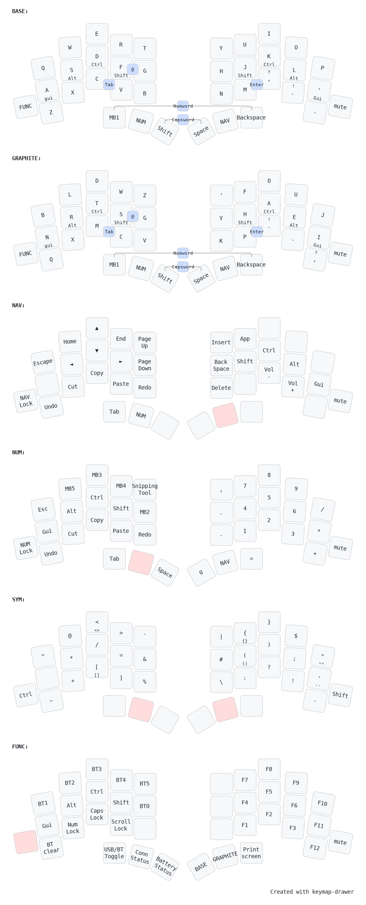

# t4corun ZMK Config

Relearning ZMK after a long hiatus (2023), primarily to play with a XIAO Dongle and GEIST TOTEM combination

## Features

This is a port of my QMK Firmware keymap. It is inspired by Miryoku and designed with SQL and Powershell in mind. It features

- Supports Zephyr 4.1
- Builds dongle firmware for Prospector and RGB Widget
- Macros for brackets (e.g. type {} and placed the cursor inside)
- urob's Timerless homerow mods
- urob Numword

## Layout

## Learnings

- The totem is a composite board
- The two outer pinky keys are part of the outer column, bottom row
- The order of includes isn't strict.
- These were removed because they were blank. They are not needed
  - config/t4corun.conf
  - boards/shields/totem/totem_left.conf
  - boards/shields/totem/totem_right.conf

## Wishlist

- Can we do OS mod swap like QMK?

### Special Thanks

geigeigeist, for making a beautiful, well documented keyboard, and making it free
eigatech, for sharing the dongle code
rafaelromao, for the macro helpers
urob, for the timerless setup, autolayer for numword
caksoylar, for the general organization and rgbled widget
